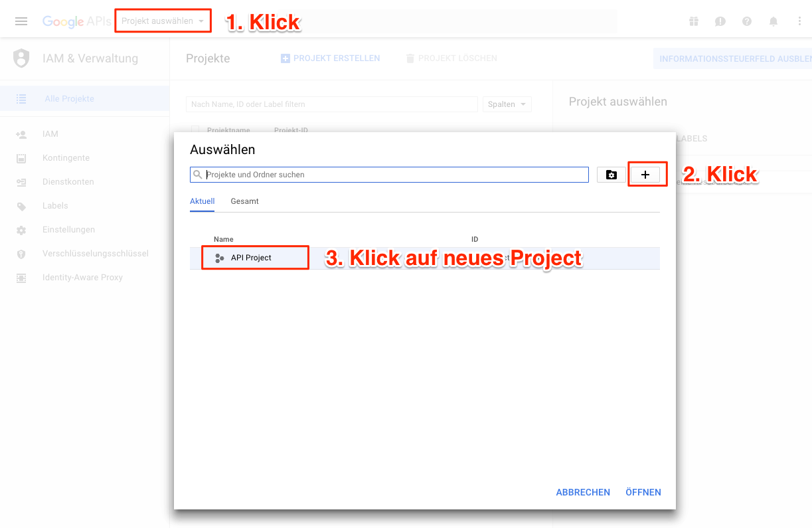
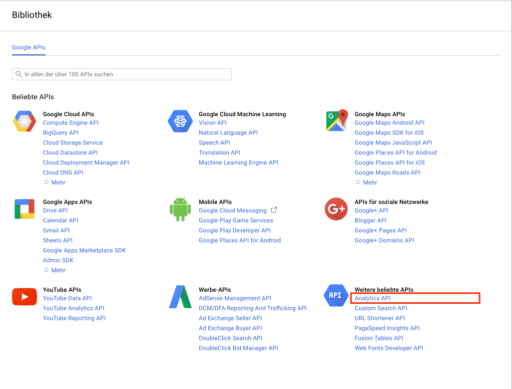
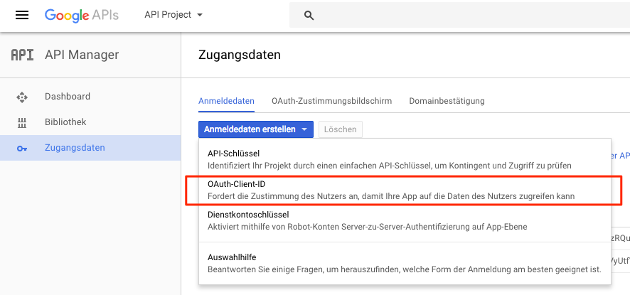
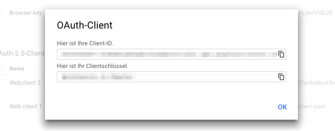

---
# http://learn.getgrav.org/content/headers
title: Der Google Analytics O'Pie
slug: dashboard_ga
# menu: Der Google Analytics O'Pie
date: 07-05-2012
published: true
publish_date: 07-05-2012
# unpublish_date: 07-05-2012
template: docs
# theme: false
visible: true
summary:
    enabled: true
    format: short
    size: 128
taxonomy:
    migration_status: done
    category: [docs]
    tag: [core]
# added collection selector

author:
    name: admin
metadata:
    author: admin
#      description: Your page description goes here
#      keywords: HTML, CSS, XML, JavaScript
#      robots: noindex, nofollow
#      og:
#          title: The Rock
#          type: video.movie
#          url: http://www.imdb.com/title/tt0117500/
#          image: http://ia.media-imdb.com/images/rock.jpg
#  cache_enable: false
#  last_modified: true
---

Als Bestandteil des MailBeez Grundsystemes erlaubt Ihnen der Der Google Analytics O'Pie schnell und einfach die vom Google Analytics erfassten Daten (Besucher, Umsatz) der MailBeez Emails einzusehen.

>>>>>Um dieses Widget zu nutzen muss Google Analytics - gerne mit Ecommerce Tracking - im Shop installiert sein.

####Häufig gestellte Fragen 

**Warum unterscheiden sich die Google Analytics-Daten von MailBeez Analytics Data?**

Google Analytics kann nur Bestellungen verfolgen, die nach dem Klicken auf einen Link in einer von MailBeez generierten E-Mail getätigt wurde. Wenn zum Beispiel ein Kunde einen MailBeez Coupon auf seinem mobilen Gerät empfängt, aber später seine Bestellung auf seinem Computer durchführt und dabei den Rabatt-Code aus der Email abtippt, wird die Google Analytics Verbindung zum MailBeez Email verlieren.

Umgekehrt kann aber MailBeez alle Bestellungen mit generierten Coupons in MailBeez Analytics verfolgen, egal ob der Kunde den Link in der E-Mail klickt oder manuell in die Coupon-Code aus der E-Mail eintippt.

**Warum habe ich so wenigen Klicks in Google Analytics erfasst?** 

Einige Online-Shops haben kein Google Analytics-Tracking auf ihrer Start-Seite, nur auf Unterseiten. Wenn Ihre MailBeez E-Mails einen Link zu Start-Seite enthält, werden diese Besuche (und die daraus resultierenden Käufe), nicht von Google Analytics erfasst werden können.

 

## Das Google Analytics Dashboard Widget 

Um die Konfiguration zu erleichtern, folgen Sie bitte den folgenden Schritten:

### Schritt 1: Erstellen Sie ein Google API Project 

1. Bitte gehen Sie zu : <https://code.google.com/apis/console/> und melden Sie sich ggf. an

2. Legen Sie jetzt mit Klick auf den + Button ein neues Project an:

4. Mit Klick auf das neu angelegte Projekt gelangen Sie zum Projekt Dashboard. Dort bitte die API aktivieren und die Analytics API hinzufügen: 
  
  

7. Wählen Sie "Zugangsdaten" im linken Menü und erstellen Sie dann Anmeldedaten vom Typ "OAuth-Client-ID)" 

9. Sie werden jetzt aufgefordert, folgende Daten zu konfigurieren  
 **Anwendungstyp** - Webanwendung  
 **Name** - MailBeez  
 **Autorisierte Javascript Quellen** - bitte die URL aus dem Widget kopieren und einfügen  
 **Autorisierte Weiterleitungs-URLs** - bitte die URL aus dem Widget kopieren und einfügen  
 Klicken Sie dann auf den "Erstellen" button

 10. Es öffnet sich ein Fenster mit `Client-ID` und `Clientschlüssel`. Die Einrichtung der API ist damit abgeschlossen und Sie sehen die im weiteren Schritt benötigten Daten

22. Die Daten `Client-ID` und `Clientschlüssel` bitte kopieren bzw. das Fenster offen behalten.

### Schritt 2: Konfiguration des Dashboard Widgets

1. Navigieren Sie zum Google Analytics Dashboard Widget auf Ihrem MailBeez Dashboard:

3. Geben Sie `Client-ID` und `Clientschlüssel`t aus der Google API Console ein & und klicken Sie den “bestätigen” Button

4. Click the “Connect” button to connect your widget to your Google account:

6. Wenn Sie nicht in bei Google angemeldet sind, werden Sie den Google Login Screen sehen. Melden Sie sich an, um zum Google Authentication Dialog zu gelangen. Wenn Sie bei Google angemeldet sind, werden Sie direkt zum Google Authentication gelangen:

9. Klicken Sie auf “Zugriff erlauben” und Sie kommen zurück zum MailBeez Dashboard, wo Sie jetzt eine Liste der Google Profile sehen. Bitte wählen Sie das passende:

11. Nach der Auswahl des Profils, werden Sie den Google Analytics-O-Pie sehen:

Alternativ können Sie zur Konfiguriation des Widgets auch auf den “konfigurieren” Link unter dem Widget klicken, allerdings sollten Sie dort die Daten nur in Ausnahmefällen bearbeiten.
